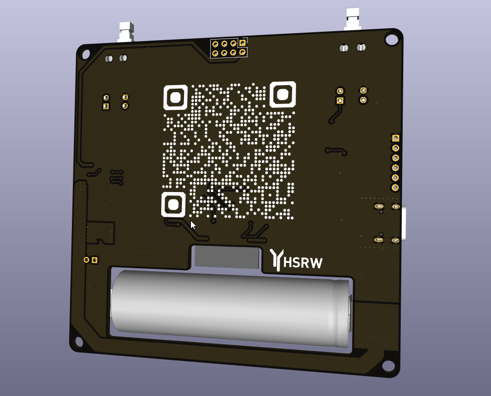
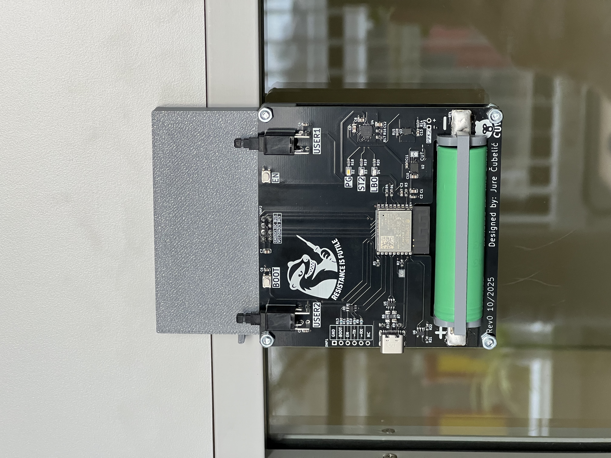
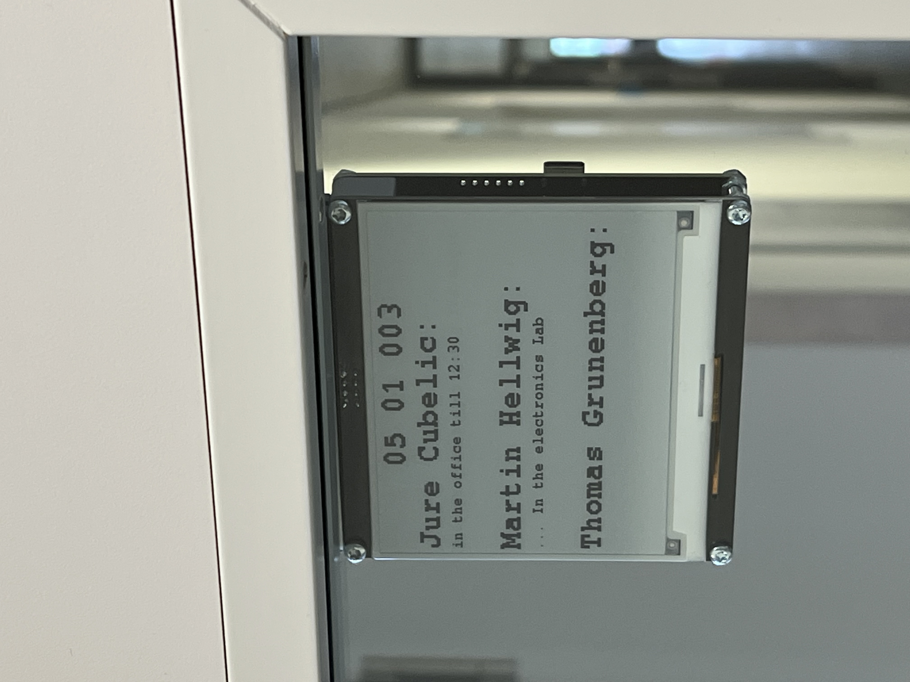
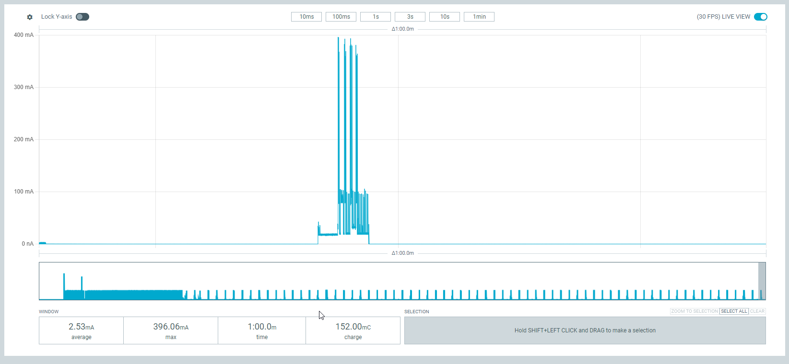
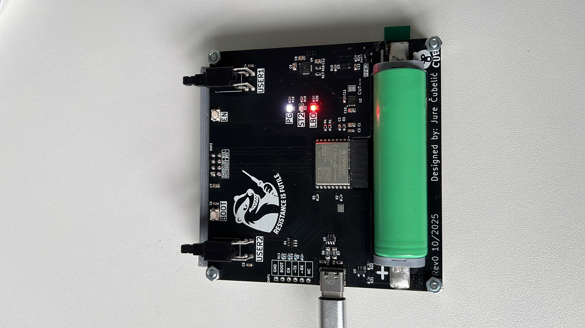
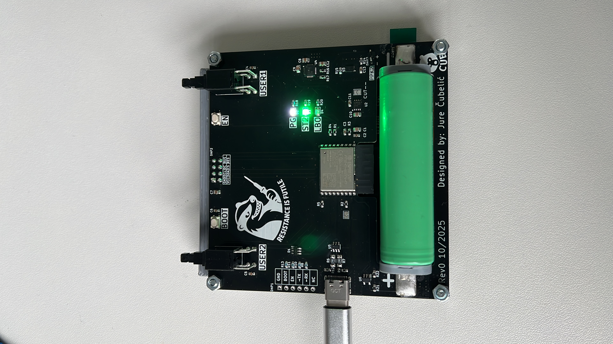

# E-paper Gadget

## Overview

**EpapGadget** is a self contained solution and development platform for Epaper displays. More specifically the PCB is based on the ESP32-C3, taylored for the display [WeAct-Epaper4.2"](https://github.com/WeActStudio/WeActStudio.EpaperModule), and battery powered suitable for wall/door/monitor mounting. In this repo continuous development is done on two firmware solutions; Co-op, Solo.

<!-- To-do: Add more photos to the list -->

 
   
   

 

**Key Features:**
- E-paper display
- ESP32-C3-WROOM-02
- WiFi
- USB-C for charging, programming, power
- System Load Sharing between Battery and USB-C 
- Works a month or more on a single charge (depending on the sleep cycle)
- Updated via Telegram Bot API
- Screen updates every 6s/60s/custom

---

## Project Structure

| Folder | Description | Contents |
|--------|-------------|-------------|
| **CAD_files** | Contains CAD files  | Mounting parts, battery holder and clip |
| **ECAD_files** | Contains PCB files | Rev0  |
| **Images** | Report relevant snippets | Images |
| **Source_Code** | Firmware developed for this project | Co-op, Solo |

---

## Final Results

Images of project mounted on the door frame and in operation running CO-OP firmware.

 
   
   

  

---
## Firmware

Co-op: 
Designed for up to 3 people where they can send telegram messages in a groupchat that appear on the Epaper display. Depending on the location of the device, messages can be directed to a specific person or group or the broader public view. 

Example1: Suitable for mounting on office or workshop doors and leaving relevant information to anyone who comes by such as "I'll be back in 15min" or "Not here today".

Example2: Can be placed somewhere at home for example for motivation messages to you family members, loved ones, or friends such as "Have a productive day {insert name}" or "Could you please take out the trash I couldn't manage this morning".  

Solo:
Peronalised TODO list for busy/forgetfull people to unclogg the phone with endless todo lists and apps, once you randomly remember you need to do something you can send a message to your telegram bot and once you come back to your work station the **Task** that needs to be done will be displayed on your Epaper display preventing that you forget what you had in mind. 

---
## Power Consumption 
All the current measurements were conducted with the [Power profiler Kit ||](https://www.nordicsemi.com/Products/Development-hardware/Power-Profiler-Kit-2), see bellow:

 
   

 

From the given measurement results it can be concluded that with the current consumption of 2.5mA on average at the 60s deep sleep cycle this gives the project a theorethical ~1000 hours of working time with the standard 2500mAh 18650 cells. Thats just under 42 days, with a generous 25% safety margin it can be said that the device requires a charge once a month. 

 
   
   

 

---
## Future Work
- Revision 1 intended to host the bare 4 inch epaper display instead of the module 
- consolidate BOM 
- code optimisation + additional features still in progress(bat/wifi icon, user inputs, aesthetics) 

---
## Sponsor Acknowledgment
I extend my heartfelt gratitude to **PCBWay** for their generous support and contribution to this project.  
Their commitment to fostering innovation and learning in PCB design has been instrumental in making this project possible.  
I am very pleased with the **customer support** throughout the process and even more with the **quality of the delivered printed circuit boards.**

**Contact Information**  
For inquiries or to learn more about PCBWay, please visit [www.pcbway.com](https://www.pcbway.com)  
or contact them directly at 📧 **service@pcbway.com**

---
## Author

Developed by **cubeli27**  
For questions or collaboration, feel free to reach out. See my contact info in the [profile repo](https://github.com/cubeli27/cubeli27).
